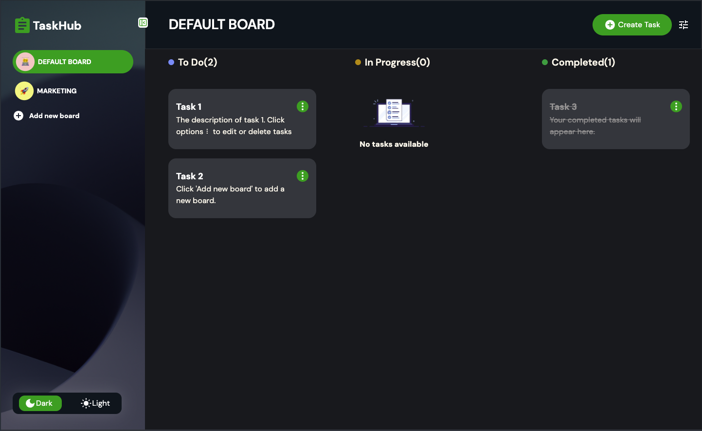
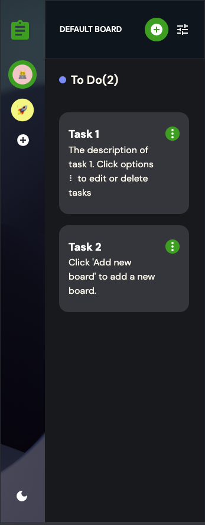

# TaskHub

TaskHub is a task management web application that helps you organize and manage your tasks efficiently. It allows you to create boards, add tasks, and track their progress through different stages such as "To Do", "In Progress", and "Completed". The application also supports dark and light themes for better user experience.

## Features

- **Create Boards**: Add new boards to organize your tasks.
- **Add Tasks**: Create tasks with titles and descriptions.
- **Edit Tasks**: Modify task details and move tasks between columns.
- **Delete Tasks**: Remove tasks that are no longer needed.
- **Dark/Light Theme**: Toggle between dark and light themes.
- **Responsive Design**: Works well on both desktop and mobile devices.

## Technologies Used

- **React**: A JavaScript library for building user interfaces.
- **Vite**: A build tool that provides a faster and leaner development experience for modern web projects.
- **Tailwind CSS**: A utility-first CSS framework for rapid UI development.
- **MUI (Material-UI)**: A popular React UI framework.
- **Framer Motion**: A library for animations and gestures in React.
- **React UUID**: A library to generate unique IDs for tasks and boards.

## Getting Started

### Prerequisites

- Node.js (v14 or higher)
- npm (v6 or higher)

### Installation

1. Clone the repository:
   ```sh
   git clone https://github.com/VictorKevz/Task-Manager.git
   cd Task-Manager
   ```

2. Install dependencies:
   ```sh
   npm install
   ```

3. Start the development server:
   ```sh
   npm run dev
   ```

4. Open your browser and navigate to `http://localhost:5173`.

### Building for Production

To build the project for production, run:
```sh
npm run build
```

The production-ready files will be in the 

dist

 directory.

### Deployment

To deploy the application to GitHub Pages, run:
```sh
npm run deploy
```

## Project Structure

```
├── public/
│   ├── screenshots/
│   └── ...
├── src/
│   ├── assets/
│   ├── components/
│   │   ├── AddBoardModal/
│   │   ├── AddTaskModal/
│   │   ├── AsideBar/
│   │   ├── MainBoard/
│   │   ├── TaskCard/
│   │   ├── Theme/
│   │   └── WarningModal/
│   ├── App.css
│   ├── App.jsx
│   ├── index.css
│   ├── logoData.js
│   ├── main.jsx
│   └── variants.js
├── .gitignore
├── eslint.config.js
├── index.html
├── package.json
├── postcss.config.js
├── tailwind.config.js
└── vite.config.js
```

## Contributing

Contributions are welcome! Please follow these steps to contribute:

1. Fork the repository.
2. Create a new branch (`git checkout -b feature-branch`).
3. Make your changes and commit them (`git commit -m 'Add new feature'`).
4. Push to the branch (`git push origin feature-branch`).
5. Open a pull request.

## License

This project is licensed under the MIT License. See the LICENSE file for details.

## Acknowledgements

- [React](https://reactjs.org/)
- [Vite](https://vitejs.dev/)
- [Tailwind CSS](https://tailwindcss.com/)
- [MUI](https://mui.com/)
- [Framer Motion](https://www.framer.com/motion/)
- [React UUID](https://www.npmjs.com/package/react-uuid)

## Screenshots

   

```
